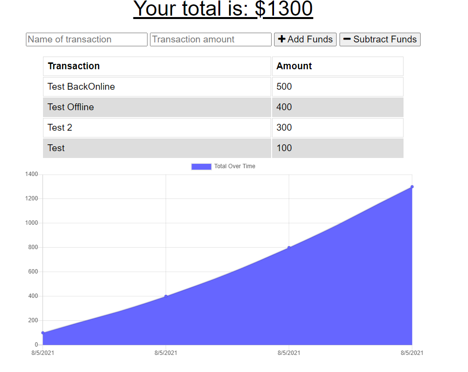
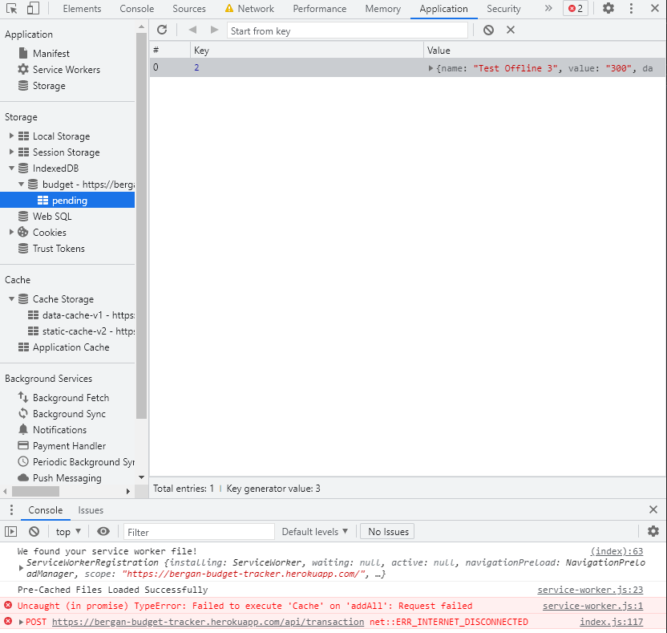
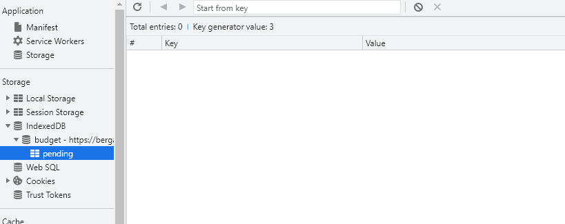

# 19_OfflineBudgetTracker

This budget tracker application allows users the functionality of adding or deducting expenses with or without an internet connection. As transactions are processed offline, the service worker allows for the population of tracked data as the application goes back live.

## User Story

AS AN avid traveller
I WANT to be able to track my withdrawals and deposits with or without a data/internet connection
SO THAT my account balance is accurate when I am traveling

## Business Context

Giving users a fast and easy way to track their money is important, but allowing them to access that information anytime is even more important. Having offline functionality is paramount to our applications success.

## Acceptance Criteria

GIVEN a user is on Budget App without an internet connection
WHEN the user inputs a withdrawal or deposit
THEN that will be shown on the page, and added to their transaction history when their connection is back online.

---

## Links

[Link to GitHub Repository](https://github.com/bergannation/19_OfflineBudgetTracker)

[Link to Heroku Deployed Application](https://bergan-budget-tracker.herokuapp.com/)

## Table Of Contents

- [Description](#Description)
- [Installation](#Installation)
- [Gallery](#Gallery)
- [Questions](#Questions)

## Description

This application uses the following technologies:

- HTML
- CSS + Bootstrap
- Javascript
- Node.js
- MongoDB

## Installation

- Install Your Package using:

```terminal
npm i
```

- Run the Application using:

```terminal
npm start
```

- When the Application has been launched successfully, open the Browser to navigate to: 'localhost:3000'

## Gallery

- Example of operating Budget Tracker
  
- Offline Application Example
  
- When offline, the data will be stored in the IndexedDB as seen on the left hand side.

  

- You can see upon coming back online, the data was added and cleared from pending

## Questions

Here is a link to my github for more information: [Github]: https://github.com/BerganNation

You can reach me with any additional questions by email: BerganNation@gmail.com
